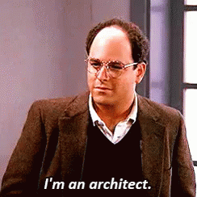

### Hi there 👋
### I'm Mashaan, that's (مشعان) in Arabic

### Education

2013 --> [KFUPM](http://www.kfupm.edu.sa/) --> 2016 --> **MS** &rarr; :arrow_right:

                                                                    :arrow_right:
                                                                    
                                                                          :arrow_right:

[Sydney Uni](https://www.sydney.edu.au/) ---> **PhD**

[KFUPM](http://www.kfupm.edu.sa/) -------> **MS**

### Coding

### Skills

  

